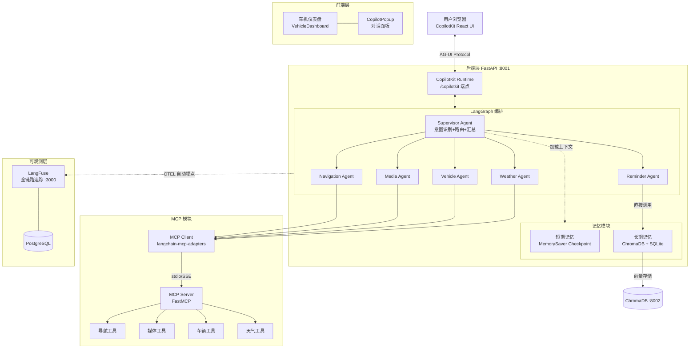

# AutoMind 架构设计文档

> 基于 LangGraph + MCP + CopilotKit 的工业级车载智能助手系统架构

---

## 一、系统架构图



---

## 二、数据流说明

### 2.1 一次完整对话的处理流程

```
1. 用户在前端输入 "导航去公司，顺便放点音乐"
        │
        ▼
2. CopilotKit 通过 AG-UI 协议发送到 /copilotkit 端点
        │
        ▼
3. CopilotKit Runtime 调用 LangGraph Supervisor 图
        │
        ▼
4. Supervisor 节点：
   a. 从记忆模块加载用户上下文（偏好、提醒）
   b. LLM 分析意图 → 决定路由
   c. 这是一个复合请求 → 先委派 navigation_agent
        │
        ▼
5. Navigation Agent:
   a. 调用 MCP Client → MCP Server
   b. 执行 plan_route 工具 → 返回路线
   c. 返回结果给 Supervisor
        │
        ▼
6. Supervisor 再次路由 → 委派 media_agent
        │
        ▼
7. Media Agent:
   a. 调用 play_music 工具 → 开始播放
   b. 返回结果给 Supervisor
        │
        ▼
8. Supervisor 汇总两个 Agent 的结果
   → 生成自然语言回复
        │
        ▼
9. CopilotKit 将回复流式传输到前端
        │
        ▼
10. LangFuse 记录完整 trace（所有节点的输入输出）
```

### 2.2 记忆系统数据流

```
用户交互 → Supervisor 处理
                ├─ 读取：recall_preferences(语义召回) + get_profile(结构化)
                ├─ 执行任务
                └─ 写入：
                    ├─ save_preference(新偏好 → embed → ChromaDB)
                    ├─ update_profile(确定性数据 → SQLite)
                    └─ add_reminder(提醒 → SQLite)
```

---

## 三、各模块职责

| 模块 | 职责 | 技术实现 |
|------|------|----------|
| **Supervisor** | 意图识别、任务分发、结果汇总、模糊意图澄清 | LangGraph state graph + langgraph-supervisor |
| **Navigation Agent** | 路径规划、POI搜索、路况查询 | create_react_agent + MCP 导航工具 |
| **Media Agent** | 音乐播放控制、音量调节 | create_react_agent + MCP 媒体工具 |
| **Vehicle Agent** | 车窗/空调/门锁/座椅控制 | create_react_agent + MCP 车辆工具 |
| **Weather Agent** | 天气查询、预报、出行建议 | create_react_agent + MCP 天气工具 |
| **Reminder Agent** | 日程管理、偏好保存、上下文提醒 | create_react_agent + 内置工具(直接操作记忆) |
| **短期记忆** | 多轮对话上下文保持 | LangGraph MemorySaver (thread_id 隔离) |
| **长期记忆** | 用户偏好持久化与语义召回 | ChromaDB (向量) + SQLite (结构化) |
| **MCP Server** | 标准化暴露车辆工具集 | FastMCP + Model Context Protocol |
| **MCP Client** | 发现并加载 MCP 工具 | langchain-mcp-adapters MultiServerMCPClient |
| **CopilotKit Runtime** | 桥接前端与 LangGraph | CopilotKitRemoteEndpoint + LangGraphAgent |
| **LangFuse** | 全链路可观测 | OTEL 自动埋点 |

---

## 四、技术选型理由

### 4.1 为什么选 LangGraph 而非 AutoGen / CrewAI？

| 对比维度 | LangGraph | AutoGen | CrewAI |
|----------|-----------|---------|--------|
| 架构模型 | 状态图（循环/分支/并行） | 对话驱动 | 角色驱动 |
| 状态管理 | Checkpoint 时间旅行 | 弱 | 弱 |
| 人在回路 | 原生 interrupt 支持 | 需手动 | 需手动 |
| 调试工具 | LangGraph Studio 可视化 | 无 | 无 |
| 可观测性 | LangSmith/LangFuse 集成 | 弱 | 弱 |
| 生产成熟度 | 工业级，字节/阿里等在用 | 研究导向 | 偏轻量 |

**结论**: LangGraph 的状态图模型最适合车机场景的多步骤编排，且具备最完善的调试与可观测生态。

### 4.2 为什么选 MCP (Model Context Protocol)？

MCP 是 Anthropic 于 2024 年底推出的开放标准，已成为 Agent 工具层的事实标准：

- **标准化**: 工具定义与调用解耦，一次定义到处使用（Claude Desktop、Cursor、任意 MCP Client）
- **解耦**: Agent 逻辑与工具实现分离，新增工具只需在 MCP Server 注册
- **生态**: 已有数百个社区 MCP Server（GitHub、数据库、文件系统等）
- **前沿**: 2025-2026 面试中 MCP 是最高频的技术话题

### 4.3 为什么选 CopilotKit？

- **原生 Generative UI**: Agent 可以动态决定渲染什么 React 组件
- **AG-UI 协议**: 被 Google、Microsoft 采用的 Agent-UI 交互标准
- **LangGraph 深度集成**: 官方合作，Python SDK 无缝对接
- **商业友好**: MIT 协议，可商用

### 4.4 为什么选 ChromaDB？

- **轻量**: 无需额外服务，嵌入式运行
- **MIT 协议**: 商业友好
- **与 LangChain 集成**: 官方 partner 包

---

## 五、目录结构

```
vehicle-agent/
├── backend/                    # Python 后端
│   ├── app/
│   │   ├── main.py            # FastAPI 入口 + CopilotKit Runtime
│   │   ├── config.py          # 全局配置
│   │   ├── graph/             # LangGraph 编排
│   │   │   ├── state.py       # AgentState 定义
│   │   │   ├── supervisor.py  # Supervisor 图构建
│   │   │   └── routing.py     # 意图路由
│   │   ├── agents/            # 5 个子Agent
│   │   ├── memory/            # 记忆模块 (短期+长期)
│   │   ├── mcp/               # MCP 工具服务器
│   │   │   ├── server.py      # FastMCP 服务器
│   │   │   ├── client.py      # MCP Client 集成
│   │   │   └── tools/         # 4 类工具实现
│   │   ├── models/            # LLM 工厂
│   │   └── utils/             # 可观测性
│   ├── langgraph.json         # Studio 配置
│   └── Dockerfile
├── frontend/                  # React 前端
│   ├── src/
│   │   ├── App.tsx            # CopilotKit Provider
│   │   └── components/        # 车机仪表盘组件
│   └── Dockerfile
├── deploy/
│   └── docker-compose.yml    # 全栈编排
└── docs/
    ├── local-dev.md          # 本地开发指南
    └── architecture.md       # 本文档
```

---

## 六、核心可配置变量

| 变量 | 默认值 | 说明 |
|------|--------|------|
| `${LLM_API_KEY}` | - | 百炼平台 API Key |
| `${LLM_API_BASE}` | `dashscope.aliyuncs.com` | LLM API 地址 |
| `${LLM_MODEL}` | `deepseek-v3` | 使用的模型 |
| `${MCP_TRANSPORT}` | `stdio` | MCP 传输方式 |
| `${MCP_SERVER_URL}` | `localhost:8765` | SSE 模式 MCP 地址 |
| `${MAP_SERVICE_PROVIDER}` | `amap` | 地图服务商 |
| `${CHROMA_PERSIST_DIR}` | `./data/chroma` | 向量库存储路径 |
| `${SQLITE_DB_PATH}` | `./data/memory.db` | 结构化记忆路径 |
| `${LANGFUSE_HOST}` | `localhost:3000` | LangFuse 地址 |
| `${DEFAULT_VEHICLE_USER_ID}` | `demo_user_001` | 默认用户标识 |
| `${DEFAULT_VEHICLE_TEMP}` | `22` | 默认空调温度 |
